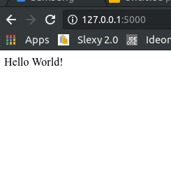

# pipenv training 2019
## Presentation
[Slides link](https://docs.google.com/presentation/d/1MP1DaIDY3ilyip0AnFQqEOcVocT94DiN70GtV8GmKms/edit?usp=sharing)

## Tutorial

1. Create new project
    ```
    > pipenv --python 3.7
    ```

    1. Check dependency graph
        ```
        > pipenv graph

        ## its empty now 
        ```

    1. Check that `Pipfile` is created in current directory. With some
      basic meta-data filled like url and name, 
      ready file would present like this.

        ```
        [[source]]
        url = "https://pypi.python.org/simple"
        verify_ssl = true
        name = "pypi"

        [dev-packages]

        [packages]

        [requires]
        python_version = "3.7"
        ```
    1. Check couple of things:
        ```
        > pipenv --where                                                                                                                                             17:29:00
        #/home/lb_lb/Projects/GIT/pipenv-training-2019
        
        >  pipenv --venv                                                                                                                                              17:29:22
        #/home/lb_lb/.local/share/virtualenvs/pipenv-training-2019-wSj950Z4

        ```
        Firstly, is localization of `pipenv` output project. It could be
        helpful if you are in `pipenv shell` environment. 
        
        Secondly you can search localization of your virtual environment
        directory. This is same structure as `venv` creates, beacuse `pipenv`
        is using `venv` inside. 

        ```
        tree -d -L 4 /home/lb_lb/.local/share/virtualenvs/pipenv-training-2019-wSj950Z4
        ```

        ```
        /home/lb_lb/.local/share/virtualenvs/pipenv-training-2019-wSj950Z4
        ├── bin
        └── lib
            └── python3.7
                ├── collections -> /usr/lib/python3.7/collections
                ├── distutils
                ├── encodings -> /usr/lib/python3.7/encodings
                ├── importlib -> /usr/lib/python3.7/importlib
                ├── lib-dynload -> /usr/lib/python3.7/lib-dynload
                └── site-packages
                    ├── pip
                    ├── pip-19.0.2.dist-info
                    ├── pkg_resources
                    ├── __pycache__
                    ├── setuptools
                    ├── setuptools-40.8.0.dist-info
                    ├── wheel
                    └── wheel-0.32.3.dist-info
        ```

1. Add dependency to `flask` library  

    1. Open Pipfile with your favourite editor and add following 
    line in `packages` section:
            
        ```
        [packages]
        flask = "*"
        ```        
        This installs newest available `Flask` library version.
        Flask is an web micro-framework, used in dyndamic web pages. 
    
    1.  Check dependency graph now:
        ```
        > pipenv graph
        
        ##
        Flask==1.0.2
        - click [required: >=5.1, installed: 7.0]
        - itsdangerous [required: >=0.24, installed: 1.1.0]
        - Jinja2 [required: >=2.10, installed: 2.10]
          - MarkupSafe [required: >=0.23, installed: 1.1.0]
        - Werkzeug [required: >=0.14, installed: 0.14.1]
        ```
        As you can see, Flask has transitional dependencies to 
        couple of libraries used internally. 
        Those are available in your modules too. 
        But if it's necessary, you should add them to yours packages 
        list on your own. Because depending on transitional 
        dependencies could be error prone, let's imagine that Flask 
        developers removes dependency on `click` library, 
        while you depend on it. Then this dependency would be removed, 
        and your modules would no longer able to link to those lib. 
        Solution is to simply add `click = ">=5.1" to your own pipenv file.
    
    1. Another thing which happend is new file in your project root 
    directory named `Pipfile.lock`. Let's check it out:
    
        ```
        > less Pipfile.lock
        ```
        
        You should see something similiar to: 
        
        ```
        {
            "_meta": {
                "hash": {
                    "sha256": "49179cba82a1341dd79d2b149dbdd7f2e2ad3e455ca557d9f489bf0ba71e5526"
                },
                "pipfile-spec": 6,
                "requires": {
                    "python_version": "3.7"
                },
                "sources": [
                    {
                        "name": "pypi",
                        "url": "https://pypi.python.org/simple",
                        "verify_ssl": true
                    }
                ]
            },
            "default": {
                "click": {
                    "hashes": [
                        "sha256:2335065e6395b9e67ca716de5f7526736bfa6ceead690adf616d925bdc622b13",
                        "sha256:5b94b49521f6456670fdb30cd82a4eca9412788a93fa6dd6df72c94d5a8ff2d7"
                    ],
                    "version": "==7.0"
                },
                "flask": {
                    "hashes": [
                        "sha256:2271c0070dbcb5275f...",
                        "sha256:a080b744b7e345ccfc..."
                    ],
                    "index": "pypi",
                    "version": "==1.0.2"
                },
                "jinja2": {
                    "hashes": [
                        "sha256:74c935a1b8bb9a3947c50a54...",
                        "sha256:f84be1bb0040caca4cea721f..."
                    ],
                    "version": "==2.10"
                },

                (...)
            },
            "develop": {}
        }
        ```

        This file is how `pipenv` acheives it's "true deterministic" builds.
        As you can see even when we haven't specified `Flask` version it's already
       frozen here. This means that each time you would run install comand even on 
       new virtual env (ex. when you clone project from githab), you would install
       litteraly same libraries with the precission to sha256 hashes!  
       This leads us also to security precations. Lets imagine spoofed pypi
       repository with trojan infected `click ` library, nightmare, not with 
       hashes. :)

    1. Let's check `site-packeges` as before:
        ```
        tree -d -L 4 /home/lb_lb/.local/share/virtualenvs/pipenv-training-2019-wSj950Z4
        ```
        Please note that now all dependencies from `Pipfile.lock` are 
        installed in `site-packages` directory.
        ```
        /home/lb_lb/.local/share/virtualenvs/pipenv-training-2019-wSj950Z4
        ├── bin
        └── lib
            └── python3.7
                ...
                └── site-packages
                    ├── click
                    ├── Click-7.0.dist-info
                    ├── flask
                    ├── Flask-1.0.2.dist-info
                    ├── itsdangerous
                    ├── itsdangerous-1.1.0.dist-info
                    ├── jinja2
                    ├── Jinja2-2.10.dist-info
                    ├── markupsafe
                    ├── MarkupSafe-1.1.0.dist-info
                    ├── pip
                    ├── pip-19.0.2.dist-info
                    ├── pkg_resources
                    ├── __pycache__
                    ├── setuptools
                    ├── setuptools-40.8.0.dist-info
                    ├── werkzeug
                    ├── Werkzeug-0.14.1.dist-info
                    ├── wheel
                    └── wheel-0.32.3.dist-info
        ```

1. Let's write some code then and try our new toys
        
    Add new file named `hello.py` and add following code inside. 

    ```
      from flask import Flask
      app = Flask(__name__)

      @app.route("/")
      def hello():
          return "Hello World!"
    ```
    Try to run application by: 

    ```
    > FLASK_APP=hello.py flask run                                       
    ```
    ... this is what happend:
    ```
    env: ‘flask’: No such file or directory
    ```
    That's because `pipenv` by default is not activating `venv` in the current directory. So how to run application? 

    First you need to activate your `venv` in `pipenv` you can simply open new shell session by running: 
    
    ```
    > pipenv shell
    
    (pipenv-training-2019-wSj950Z4) ⋊> _
    ```
    Now all your dependencies, installed in `site-packages` are in your shell scope and `venv` is activated. Notice the `venv` name in your prompt, this indicates that everything is ok. (tested on Ubuntu, fish shell, but should work in any similiar environment)

    Try to run our hello world again:
    ```
    > FLASK_APP=hello.py flask run   
    
    # OUTPUT: 
    * Serving Flask app "hello.py"
    * Environment: production
      WARNING: Do not use the development server in a production environment.
      Use a production WSGI server instead.
    * Debug mode: off
    * Running on http://127.0.0.1:5000/ (Press CTRL+C to quit)
    ```
    Now you can browse our app in your favourite browser: 

    

    Now, please close `Flask` debug server `CTRL-C` and lets play a little bit with `pipenv shell`. 
1. Installing additional dependencies

    1. Install `requests2` with pip

        ```
        > pip install requests2
        ```
        results with adding `requests2 ` to venv's `site-packages`
        ```
        > ls /home/lb_lb/.local/share/virtualenvs/pipenv-training-2019-wSj950Z4/lib/python3.7/site-packages/
        ```

        Ok. Let's remove it: 
        ```
        > pip uninstall requests2
        ```

        But, there is easier way:
        ```
        > pipenv clean
        ```
        This would remove all packages not listed in `Pipfile.lock`

        ```
        Uninstalling 'certifi'…
        Uninstalling 'chardet'…
        Uninstalling 'idna'…
        Uninstalling 'requests2'…
        Uninstalling 'urllib3'…
        ```

        Magic! You can clean up after your experiments!

    1. Install `requests2` with pipenv
        What if we really decided to use `requests2` ?
        Let's open editor and add it to `Pipfile` and... 
        wait!
        There is better way for this common task:
        
        ```
        > pipenv install requests2
        ```

        And...
        ```
        [packages]
        Flask = "*"
        "requests2" = "*"
        ```
        are both added to `Pipfile`, `Pipfile.lock` and installed in virtual environment. 
1. Running your scripts

    Aside of pipenv shell, there is another convinient way of running programs in the virtual environment. 

    Most basic one is to use `run` command:
    ```
    > pipenv run python -m flask run
    ```
    
    __Handy tip:__ 
    
    ```
    > pipenv run python
    ``` 
    This would start python repl in the `venv` context, so you can tinker
    through your ideas, with dependency managed by pipenv.
    
    During development of mid- and huge-size project it could be handy 
    to prepare some usefull scritps like:
    * depolyment script
    * packaging
    * testing
    * cleaning 
    etc. 

    Let's assume that this `FLASK_APP=hello.py flask run` is not our 
    favourite command, so it would be nice to just type:
    
    ```
    > pipenv run server
    ``` 
    
    Let's just add in our `Pipfile`:

    ```
    [scripts]
    
    #FISH:
    # I'm using Fish, `env` is used in fish shell   
    server = "env FLASK_APP=hello.py flask run"

    #BASH: 
    #server = "FLASK_APP=hello.py flask run"

    ``` 
    That's it. 

1. Set environment variables in `.env` file 

    Pipenv offers also convinient way to automatically set environment  variables within the project scope (pipenv shell).

    Let's move `FLASK_APP`, so it would be easy to set in single place, and also make `Pipfile` script a little cleaner.
    
    Start with creating `.env` file in project root directory. 
    
    ```
    FLASK_APP=hello.py 
    ```

    do not forget to remove it from the `Pipfile`. 
    ```
    [scripts]
    server = "flask run"
    ```
    Notice convinient side effect is that previous shell specific notation is now not necessary.  

    Let's try it out.

    ```
    > pipenv shell
    Loading .env environment variables…
    
    > echo $FLASK_APP

    hello.py
    ```

    now press `CTRL-D` or type `exit` to quite pipenv shell, and try to run server.
    ```
    > pipenv run server

    Loading .env environment variables…
    * Tip: There are .env files present. Do "pip install python-dotenv" to use them.
    * Serving Flask app "hello.py"
    * Environment: production
      WARNING: Do not use the development server in a production environment.
      Use a production WSGI server instead.
    * Debug mode: off
    * Running on http://127.0.0.1:5000/ (Press CTRL+C to quit)

    ```

    Combining `.env` and `pipenv run` command could be very power full 
    tool in your hands to make your terminal part of work simply joy.

1. Separation of production and development dependencies.
    
    As you probably already noticed in `Pipfile` there are two packages sections: 

    ```
    [packages]
    Flask = "*"
    "requests2" = "*"
    
    [dev-packages]
    ``` 

    Until now we were using only first section, but let's consider having `pytest` library necessity. Before pipenv, there was a pattern of creating `requirements.txt` and `dev-requirements.txt`
    files and installing them alternativelly with pip. 

    But as you can predict, pipenv deals with it in quite elegant way. 
    To install development only packages simply define them in `[dev-packaes]` section and install with:
    ```
    > pipenv install --dev
    ```
    or even shorter:
    ```
    > pipenv install pytest --dev
    ```

1. Migration back and forth

    Currently the good practcie is to keep both `Pipfile` and `requirments.txt` files in your project, especially in open-source or bigger scale projects with multiple developers. 

    If you would start `Pipfile` following snippets are going to be 
    handy.
    
      ```
      > pipenv lock -r > requirements.txt
      > pipenv lock -r -d > dev-requirements.txt
      ``` 
    It's creating `requirments.txt` file for you based on `Pipfile.lock` definitions.

    To start using pipenv in legacy `pip` project you can try following: 
    
      ```
      pipenv install -r requirments.txt
      #or
      pipenv install --dev -r dev-requirements.txt
      ```

## Sources
I've quoted few times:
* https://packaging.python.org/tutorials/installing-packages/
* https://pipenv.readthedocs.io/en/latest/
* https://realpython.com/pipenv-guide/

Big thanks to authors.
